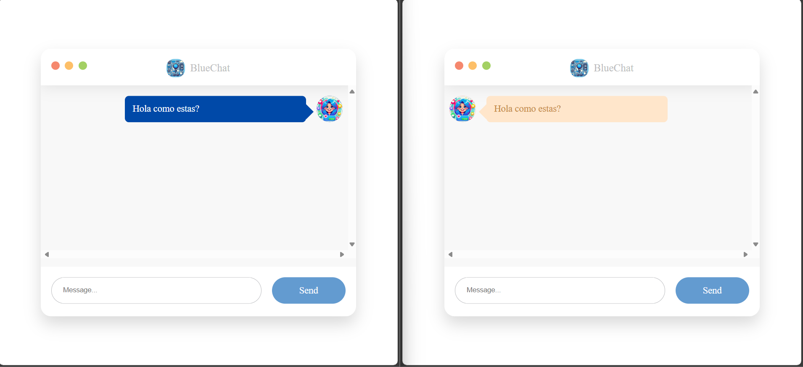

<h1 align="center" id="title">Real time messaging app</h1>

<p id="description">This is a project for the use of websockets in real-time messaging, like a cloan to some messaging application</p>

<h2>Project Screenshots:</h2>




<h2>🏳️ Requeriments:</h2>

<p>1. Java 21(JDK)</p>
<p>2. Angular 12</p>
<p>3. Spring Boot 3.0 or higher</p>

<h2>🛠️ Installation Steps:</h2>

<p>1. Clone project</p>


``` git clone https://github.com/cesarvargasL/Real-time-messaging-app.git ```

<p>2. install</p>
In the folder 'frontend' you must run the following command

``` npm install ```

<p>2. Run project</p>

* run backend for IDE:

    ``` mvn spring-boot:run ```
* run frontend for IDE:

    ``` ng serve ```


<h2>💻 Built with</h2>

Technologies used in the project:

* TypeScript
* HTML
* SCSS
* Node v14
* SpringBoot
* Angular 12
* Java 21

<h2>👾 Development:</h2>

This project is developed by 
* César Vargas
